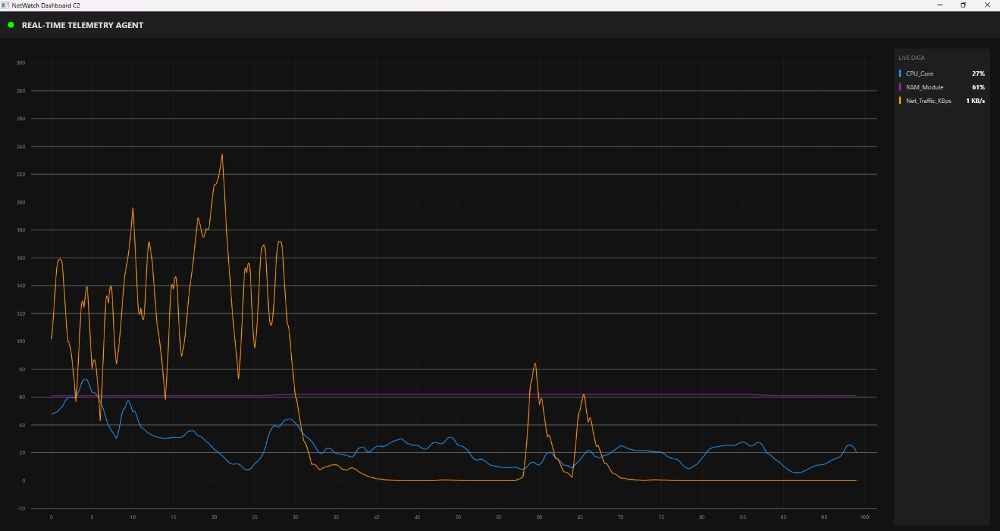

# NetWatch C2 Telemetry System


NetWatch is a distributed Command and Control (C2) monitoring system designed to visualize real-time hardware telemetry from remote agents. The project demonstrates a decoupled client-server architecture, utilizing a Python-based agent for low-level system monitoring and a .NET 8 WPF dashboard for high-performance visualization.

The communication layer relies on gRPC with Protobuf serialization, ensuring low-latency binary streaming suitable for high-throughput environments.

## System Architecture

The solution implements Clean Architecture principles with a strict separation of concerns between data collection, communication, business logic, and presentation.

### 1. Telemetry Agent (Python)
The agent acts as the field sensor, running as a background service on the host machine.
* **Technology:** Python 3.x with `psutil` library.
* **Functionality:** It bypasses high-level abstractions to access kernel metrics directly (CPU interrupts, Memory paging, Network I/O).
* **Data Processing:** Instead of raw counters, the agent calculates real-time deltas (e.g., KB/s for network traffic) before transmission to reduce client-side computation load.

### 2. C2 Dashboard (.NET 8 WPF)
The dashboard is a desktop application built on the MVVM (Model-View-ViewModel) pattern.
* **Presentation Layer:** Windows Presentation Foundation (WPF) with XAML.
* **Visualization:** Uses SkiaSharp (LiveCharts2) for hardware-accelerated rendering, capable of handling high-frequency updates (60 FPS) without UI freezing.
* **Business Logic:** Encapsulated within ViewModels, keeping the UI layer stateless and testable.

### 3. Communication Layer (gRPC)
Data is streamed over HTTP/2 using gRPC.
* **Protocol:** Defined via `.proto` files, ensuring a strict contract between the Python server and .NET client.
* **Efficiency:** Uses binary serialization (Protobuf), which is significantly lighter and faster than textual formats like JSON/REST.

## Technical Implementation Details

### Design Patterns
* **MVVM:** Complete separation between `MainWindow.xaml` (View) and `MainViewModel.cs` (ViewModel). Data binding is handled via `INotifyPropertyChanged`.
* **Dependency Injection (DI):** The `MainViewModel` depends on `IDeviceService` rather than a concrete implementation. This facilitates loose coupling and simpler unit testing.
* **Async/Await:** Network operations are offloaded to background threads (`Task.Run`), ensuring the main UI thread remains responsive during data streaming.

### Configuration
The system avoids hard-coded values. All critical parameters (endpoints, thresholds, graph history) are loaded from `appsettings.json` via the `Microsoft.Extensions.Configuration` library.

### Testing Strategy
The solution includes a dedicated test project (`NetWatch.Tests`) based on the xUnit framework.
* **Unit Testing:** Focuses on validating core business logic within the ViewModels and Helper methods.
* **Mocking:** The system utilizes manual mocking of the `IDeviceService` interface to simulate network responses, allowing for deterministic testing of the UI logic without requiring a live server connection.

## Prerequisites

* .NET 8 SDK
* Python 3.9 or higher
* Python dependencies: `grpcio`, `grpcio-tools`, `psutil`

## Build and Run Instructions

### 1. Start the Python Agent
The agent must be running to stream data. Open a terminal in the root directory:

```bash
pip install -r requirements.txt
python TelemetryService.py
```

### 2. Build and Run the Dashboard
The project is managed via a Solution file (NetWatch_Solution.sln) which links the Client and Test projects.

**Option A: Using Visual Studio**

- Open `NetWatch_Solution.sln` in Visual Studio.
- Right-click `NetWatch.Client` in the Solution Explorer and select **Set as Startup Project**.
- Press F5 to build and run.

**Option B: Using CLI**

Navigate to the client directory and run:

```bash
cd NetWatch.Client
dotnet run
```

### 3. Execute Tests
To verify system integrity and logic, run the unit tests via the solution file:

```bash
dotnet test NetWatch_Solution.sln
```

## Project Structure
```
├── NetWatch_Solution.sln       # Main solution file
├── TelemetryService.py         # Python agent entry point
├── requirements.txt            # Python dependencies
├── docs/                       # Documentation assets
│   └── Jan05UI.jpeg            # Dashboard screenshot
├── NetWatch.Client/            # WPF Dashboard Application
│   ├── Services/               # gRPC services & DTOs
│   ├── ViewModels/             # Business logic (MVVM)
│   ├── Views/                  # UI Definitions (XAML)
│   └── appsettings.json        # Configuration
├── NetWatch.Tests/             # xUnit Test Project
└── Protos/                     # Shared .proto definitions
```